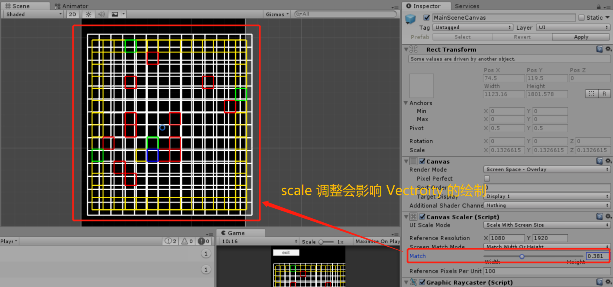
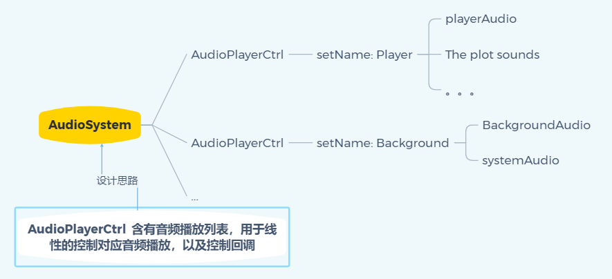

一. 游戏需求
1. map mesh:
    - 显示按钮
    - 颜色显示
    - 人物当前位置

plugins: Vectrosity
Continuous：连续
discrete：离散的
Line Points
partial: 局部

不行，实际上还是有 3D 画面部分的

2. 人物移动：
    - cardBoard // 优先级靠后
    - 移动机制，移动过程中不允许转向
    - 移动之后触发机关效果
    - 伴随音效
3. game 流程：
    - 开始结束流程
    - 音效控制
    - 加载场景

4.16 完成 map 绘制
添加 menu button to ctrl the map display

4.16 完成 3d map create and player move

4.17 finished the GUI setting and test the audio / effect

moveCtrl 加入到 player 不好的地方在于不够独立，单独作为一个控制脚本不够纯粹
若是不加入 player 反让 player 加入到 moveCtrl，比较好的地方在于独立，不好的地方在于代码的轻微浪费

MoveCtrl 还不够纯粹，因为底层结构没有铺好，没有构建一个比较完成的代码体系作为拼图依据
这里不拿的话就很难控制。
拒绝链接的话，结构上也没什么好处。简单点好，下次应该先从底层的移动大模块设计

4.21 增添 gridObj 用于存储对应 grid 的 clip 数据
数据内容为 x, y, index, color, clip: string, 实际音效放到 AudioManager 里面存储使用，当前只负责传递数据
因为绘制覆盖的 bug 会有可能导致方格变为 walk 的显示 bug。
不行正常方案修不好了。还是重新绘制地图更方便一些

4.22 增加音频控制方案
设置对应的播放列表

4.23 完成游戏基本流程是最好的，内容上可以通关，音效相对简单的调整一下。
https://blog.csdn.net/LIQIANGEASTSUN/article/details/47702483
参考音效控制 mixer

环境分为音效：
为了方便传入音效，设置一个 CONST_DEFINED 类存储对应的音频名称，并用与播放函数。

raining -> atmosphere mix raining3
走路 step 音效在 center
撞墙 wall 也在 center
obstackle 也在 center
bow 随机 random 返回判断 index 给 player。
创建新类 Parry 控制格挡
由当前格挡类生成箭矢方向，audioctrl 指定方向 audioSource 播放音效。

反正都是写，那么就加个 Event 控制播放背景音效可以通过混响进行但是其他的音效还是代码控制最好。
目前需要一个精确控制播放事件的内容。
人物和背景音乐单独分开

现在还有两个部分的功能没有结束
建议先从陷阱开始。

陷阱：
1. 先从移动位置判断是否触发陷阱建议也是 action 是最好的。action 强行加入，好处呢？我还不太清楚
2. 陷阱触发之后，触发格挡，关联音效内容，触发音效的播放对象
3. 格挡判定。是否成功，失败扣血，成功播放音效 这个部分可以放在 parry 里面处理， player 的处理功能尽量的少。

PlayerAction 在 Player Init 的时候一起初始化，是一个单例对象，包含Player 应有的所有 Action。
PlayerAction 应该和 PlayerAudioCtrl 配合使用。
PlayerAudioCtrl 也是尽量做成一个单例对象。
<!--
		if (this.checkMoveable(data) && _instance.getGameState() == GameState.Playing) {
			// 执行当前位置的特定动作
			_pos.x = x;
			_pos.y = y;
			// update to drawMap
			if (_utils != null) {
				_utils.updatePlayerData(x, y);
			}
			return true;
		}
		return false;
 -->

为什么一直要强调单例对象呢？
好处是为了非绑定脚本能够获取到对应并且唯一的对象。并非是没有用的。

两种不同模式的单例，一种是  getInstance().init() return new Object
一种是不需要要传参的 init()

我们需要验证一下 getInstance().init() 的实用性
getInstance() 时候给 static 对象创建了一个 new Object 然后执行的 init 相当于这个 new Object 执行了 init
没问题。这个写法是可以的。

UGUI https://zhuanlan.zhihu.com/p/28905447。

当前的一个 bug
Input 传入的数据是当前帧的。当 move 的时候，move 的 click 数据在 runAction 的时候也会去执行。
这导致一上来就会有一次敲击。这个设计真是狗屎。。。那就得让 move 在后面， keyBoard 在前面？

以修复，确实需要考虑 LateUpdate 和 Update 之间的关系，涉及到 keyBoard 的执行监听顺序。

4.26 今天应该完成的代码部分应该包含 atomsphere 和 obstacles 的基本音效控制。

https://my.oschina.net/asdtiang/blog/890914 异步加载参考

Script 内部的 ResourcesLoad 是不能计算在场景异步加载的情况中的。那么还是建议绑定到场景中，避免资源加载的问题

https://blog.csdn.net/fansongy/article/details/51759563 AudioClip 设置参考

判断一下 destroy 或者未定以前的指定对象是否为 null
clip = none 的时候判断 source.clip 表示会为 null

4.27 需要开始考虑 手势 的操作规范了。。。

drawLine 对象似乎只支持一次绘制，之后再次使用原有的 vector2DLine 绘制时，颜色无法更改。
public Material lineMaterial; 网上一个不错的办法是直接赋予颜色材质，这样就可以直接调用 draw 绘制有颜色的对象。而且还不用更新数据。

4.28
door 和 obstacle switch 打算给 switch 对象。
center 包含一般语音以及挥剑格挡等都放在这上面。

scheduleAudio 有个 bug 若是音效时间太短就会有问题，需要加个检测吗？
目前需要增加，若是 player 存在于某个自身音频播放状态下，那么就不能进行移动。

现在有三个部分在控制音频：
1. obstacle
2. background
3. player

switch 和 center 实际上是不会同时播放的，会有一个先后顺序。
AudioSource 一次只能播放一个音频， 因此 list 的 maxCount 是根据当前管理对象的 Count 来的。

bug 阻挡进度调忽然都不动了。。。这很有问题。
现在不能这么写，音效控制不够完善。
单独做一个控制队列，将将要播放的音效都放进去，记录内容为 name, source, isMaxTime 这样。
然后播放。

gesture 也需要分场景进行设计，那么 menuGesture, GameGesture

4.30 需要设计一个 Audio Ctrl 来控制音频播放的顺序，将需要播放的 clip 详细数据加入到 队列中，队列自己进行循环，同时建议声明一个 callback 对象
可以执行 callback 指令，通过 delegate，这样就能在音频播放完成之后自动的执行更新指令。

5.4 完成了 AudioPlay 的控制，建议明早起来把各个音频之间的关系理顺之后开始手势功能的操控。

永远不要用 DebugUtils 除非你是天才。

调整 audioPlay 的结构，可以大量的减少代码量，因为 playAudioCtrl 的重复性代码太多了

没办法，因为 move 和 parry 两个 keyBorad 的监听内容有关联，若是中间不差出一个间隔，再让用户转换状态，那就一定会导致两个按键事件相互干扰。
1. move 在 parry 之前，就会导致移动到 obstacle 多砍一刀
2. parry move 之前，格挡成功就会自动多走一步。

现在的方案是将按键放在 audio 的 callback 之后，但是这个感觉有点不好。完全依赖于 audio，多少有些不可控的因素在里面。
还有一种方案是 parry 设置一个监听属性，在 player LastUpdate 的时候监听对应属性进行状态调整。
这样做的好处是将 player 修改状态的位置同一靠后了，方便针对同样的监听事件做后续处理。
但是这样处理有个不好的要点，即，当前音频未播放完成，但是却能够走动了。
上述结构是可以要求保留的，因为有利于操作的控制。
但是现在仍是使用 audio 回调的方式控制对象。

当前结构比较不好的地方在于 audio 太多，不好管理。（也还好其实）
随着游戏内容的不断加深，相信会有更多的音频文件，到那时应该如何处理呢？

因为格挡时间的判定处理也是通过 player 的状态来管理的，因此通过音频 callback 的话就会有时间差，导致人物格挡成功后因为在继续播放音效而死亡的 bug
那么通过 player 状态来判断 parry 状态的方案就非常的糟糕。因为音频还有延迟属性。这就应该要求将 parry 的计时与 player 的状态分离开。
这样人物状态就不会去监管 parry 的运行状态

__人物运动状态与音效之间要保持和谐，也就是说 callback 管控的 state 一定要足够准确，避免产生误差，否则最后会出现音频与人物操控分离的情况。__

实际上我们并没有改变 map 的内容，只是更新了 index 的位置与 color。
所以导致了 player 的一个位置数据无法正确检索的 bug。

__触发过的陷阱应该不会再次触发。但是 switch 音效应该保留，这个部分之后再修正。__
__绘制覆盖问题，因为 drawMap 上是经过覆盖实现的 player 状态的更新，因此会有 grid 的颜色覆盖问题，不是很好处理，有一个方案是将当前覆盖部分的四个方位再重新绘制一边，虽然比较 hack 但是从效果上是可行的。否则就是要破坏现有的绘制结构。__
__“正前方有亮光” 的出口型提示__

目前策划不够完善，因此手势识别功能暂时做不了特别完善，所以死亡重生的过程还是放到 gameOver 的这个过程中。
因此后面这个部分暂时先不做的特别完善，先把流程跑通。
#### 缺少内容
- 死亡提示音效
- 死亡后手势操作
- 游戏过程中，返回主界面手势操作

现在游戏内容基本已经结束了，下面功能优先级是：
- 手势功能，手势功能能够实现的方案就很多了，比如斜上斜下之类的，左右也可以安排
- 真机测试手势
- mainScene 场景布置

手势功能设置，首先是因为手势判断是可以复用的代码，那么还是用 delegate 吧。
和 moveCtrl 一样，绑定在场景中，做一个单例。
会复用到的脚本有 Parry, moveCtrl, GameManager 三个，还要保留一些基本功能。

audioCtrl 目前的管理并不好，但是涉及资源管理方面的处理，因此目前暂定，后续资源管理更加了解之后尝试的调整文件结构与组件结构。

tips 的音效把前后空档的时间都去除。

Screen Canvas 的坐标原点在左下角

下午的工作安排，手势识别的完善，以及屏幕适配问题。
主要是游戏开始场景的 UI 的手机分辨率综合适配。
参考链接：
https://zhuanlan.zhihu.com/p/28905447
https://www.jianshu.com/p/95cb4621206e

主要调整应该会通过 CanvasCtrl 进行调整。目前只是根据手机的宽高比例对 Canvas Scale 进行了比例调整，但是内部的 UI 完全没有做任何适配。

目前手势要做区域范围限定，就需要获取 Screen Size，根据百分比安排，识别内容，将手势识别更加精细化。

GameManagerGlobalData，后期有需要了再进行修正。目前其实也不会需要，因为没打算再换场景了，即使是更新场景也是只从 DrawMap 以及 MapData 方面做接口调整。

滑动手势判定：
- 水平手势：由左向右，由右向左
- 垂直手势判定： 由上到下，由下到上。
用于菜单选定或者人物移动
- 斜方向判定：
由于暂时没有斜方向的判断，那么当用户采用了不可识别的手势的时候，我们先做简单的适配。
- 点击判定

目前 gesture 这个部分的功能还是不对的。目前一共六种情况需要安排；
1. dx
2. dy
3. dx dy 与 非 dx，dy

由于 parry 限制，目前的手势判定和格挡内容会有违和内容，parry 不存在后射内容。那么目前解决方案应该从游戏的角度解决，加入语音提示或者修改格挡数据。

区间范围的限定：
水平移动成立，垂直移动不成立的情况。
以 startPos.y 为中心点，上下设立动态范围区间。
目前是通过斜率判断，但是根据实际情况来看，滑动的水平线段越长，很有可能导致斜线部分的触发无效。
因此要根据手机分辨率比例进行动态调整斜率。
垂直方向相同

标准的 10 : 16 的最大斜率范围在 [Mathf.PI / 4, Mathf.PI / 6];  若是用Mathf.PI / 6 返回空间就会太大了。
想要实验一套可视化的内容。

这里用上 developMent

### 暂记
关于手势识别内容，不知道有没有更好的解决方案。斜率的方案是狗屎，随着 width 的增大不同比例下的判定范围甚至会超出屏幕尺寸。
固定值圈定范围会更好一些，通过标准的分辨率根据实际分辨率计算 scale 之后扩大选定范围。
暂时记一下
__Unity 场景旋转屏幕后的获取 deivce 的 width 是按照什么朝向的？__ 目前锁定游戏画面为横屏。

我擦，我甚至想做一个有剧情选项的游戏。。。fo 了

明天剩余工作量：
1. gesture
2. mainScene
3. 分辨率适配
4. backgroundAudio

__游戏成功和失败的资源暂时缺少，目前先不做处理__

__Loading Scene 添加点击之后进入游戏的提示音效__

5.14 采用了 AssetBundle 加载资源的方式，更加可靠，学习了不少。
- StartCoroutine and yield return null
- assetBundle
- defined

__5.14 最好再添加一下 上下左右移动的提示音，避免操作效果错误导致的移动判断失误。__

5.16 二版分辨率修正
Vectrosity 工具与 Canvas 有关联，若是调整 Canvas Scaler 属性会引起 重新绘制，或者绘制引用错误。
Canvas 的调整似乎有一帧的停顿，那么这一帧的数据引用就导致了错误绘制。
delete 清理 line 需要做好预防措施，直接删除 Line 属性是最好的。并且需要重新附上新的 Line。

5.20:
1. 地图修正
- 操作修正，删除后退功能。
移动的左右效果是我这边实现的吗？

2. 音效修正
- 步伐音效，攻击音效

3. 新手教学初始剧情内容修正
- 剧情内容分为两个部分，中间添加一个新手教学移动，那么 action 那边可能需要一点改动。那还是把 play audio 的教学音频都放在 player 那边会好很多，反正 GameManagerGlobalData 记录的数据是全局数据。
- 调整新手教学，格挡部分，初始格挡效果一定为 front 效果。

4. 添加怪物系统
- 新增一个状态机，需要关联 player 属性。手动查找会比较好一点。
- 一个怪物系统的基本框架。
- 战斗方案：1. 快速滑动 2. 双击攻击 3. 斜方向滑动攻击 4. 重力感应

5. audioSystem 增强
- 添加音效混合播放功能。允许同一时刻两个音效同时播放。
- 音频控制这个模块，果然还是一个效果控制一个对象会更好一些。目前也只是 player 在使用线程式的播放。处理初始化不是很方便之外，我觉得还是可以考虑将
audioPlayCtrl 分散继承出去。
目前这样的设计，缺陷就是不符合多音频管理。
但是好处就是统一下层控制，但是优势也并不明显。

https://www.cnblogs.com/wang_yb/archive/2011/05/18/2050574.html 传递引用修改参考方案

为什么 GestureCtrl 的 timer 不直接加入到 Update 运行，反而分散开。
Parry 有单独的效果需要控制 GestureCtrl
GestureCtrl 作为单独的模块具有复用性。
但是分散的控制会导致码量的增加，脚本控制范围增大。有弊端。但是独立性更好。

5.22
修改地图绘制方案程序部分修正，目前需要适应矩形地图设计。需要双循环增加损耗。

5.22 
__bug： 手机端运行无法正常跳转到 mainScene，但是跳转方法成功执行了。__
难道音频播放完成没有执行回调？
但是之前的 audio 修改并没有影响到正常运行，实测过一次。

那么问题应该在 draw 上面吗？但是 draw 的话并没有进行大改，修改了循环方式，目前还不清楚问题。
mainScene 没问题，loadingScene 没问题
但是读取场景的衔接除了问题

应该是 async 加入了 callback 导致的。
诱因：
因为 audioEffect 添加了多次的 callback，在控制 allowSceneActivation = true 的部分，防护没有做足，导致多帧进入，引起手机端运行出现了回调循环 bug。

5.23 
audioPlay 的 callback 没有执行，应该是 audipClip 的状态变化导致的这个问题。 isFinished 没有被成功的转换
似乎还有  GestureCtrl update 没有执行的问题。那么表示 player state 没有成功转换。
player state 没有成功转换。

就是 handle back 没有成功执行，操了
诱发因素有可能是因为 isFinished 转换，因为 player.time 在播放玩之后怎么了你不知道

诱因是什么，可以规避的方案很多，但是诱因是什么？
因为 List RemoveAt(0) 没有及时的清空对象？不，及时清空了，除非没有执行
目前已知，重名对象在进入 effect 内会导致不触发。因为 method 没有成功的赋值。

在 test 的测试里面并没有复现出 player.time 会在 update 中输出错误的情况，因此很难判定。

我也是 fo 了，项目内并没有一口气加入两个音效，但是产生了确实两个音效播放时的效果，妈的。

__Pause 和 Stop 的处理方案是不同的， Stop 应该属于及时操作，就能够避免 Pause 引起的暂停现象，避免了原有数据状态的干扰。__

5.26 添加地图特殊剧情管理系统
这次做了比较完善的设计，之前一直空闲的地图切换方案目前也已经确定下来。
utils 功能做了很大的补充，以目前的情况看甚至可以支持简单的数据保存。
首先是 utils 初始化的改进， 增加 utils 与 DrawMap 之间的关联，调整 utils 与 player 之间的关系。
设置 utils 为单例，因为可复用性很高。

第二段剧情也应该是可以跳过的，那么 GameManager 那边需要一个统一的状态。

添加 GameState 新状态 plot，当进入剧情时 GameManager 应当设置为 plot，并且切换当前的 GesturlCtrl Center 为 stopEffect。
这样修改日后若是 player 需要添加默写 GestureCtrl Center 交互时，就需要额外处理，目前没有就是了。

麻烦了 position 位置放在了后面。。。。那么能够获取的就是前一步的位置，这样并不够准确。
不，还是应该给委托函数都加入数据的，毕竟还是会利用到的。

这里是不是 player position 的位置我没有设计好？
处理方案一：
那么实际上应该靠后会好很多。
调整方案应该是 player 增添当前 pos data 数据，移动完成后再进行后续内容的处理。
处理方案二：
给每个 method 添加 nextPos 属性，用于同步 player 下一个位置点信息。
会造成数据无用传递